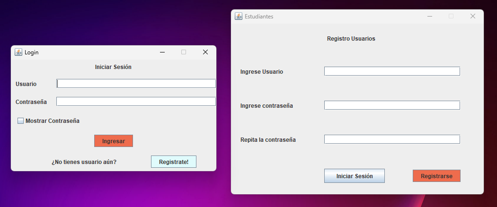
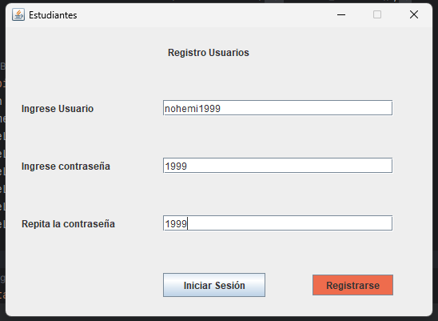
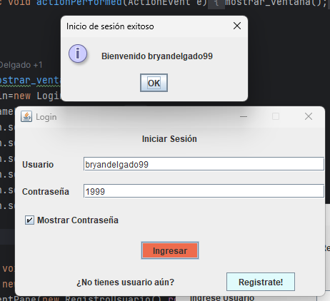
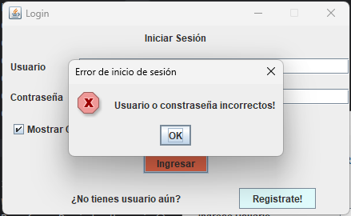
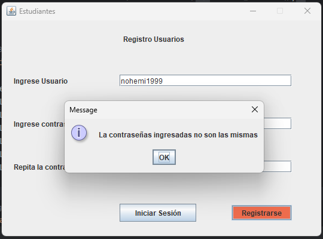

# Formulario para Alumnos con Java Swing
## Contenido
1. Integrantes
2. Acerca del Proyecto
3. Interfaz y Diseño
4. Funcionalidades

## Integrantes
* Delgado Yela Bryan Paul
* Espinel Pallasco Brittany Nohemi
* Sangucho Taco Melany Jael

## Acerca del Proyecto
Se desarrolló una interfaz de usuario que permita albergar 5 usuarios dentro de un archivo (para este caso, 
se emplea un archivo .dat), en el cual se guardarán estos usuarios y sus respectivas claves. 
El programa permite al usuario registrarse, verificar su contraseña y poder iniciar sesión en el sistema de manera
exitosa. 

<b><i>Advertencia: </i></b> Al cerrar el programa, todos los usuarios y claves respectivas que se hayan guardado
en el archivo de datos, se eliminaran y se tendran que volver a ingresar nuevamente. <b>(Error en mantenimiento)</b>

## Interfaz y Diseño
La interfaz del programa es un proceso minimalista de diseño y enfoque, creado bajo librería Swing de Java.
Esto, permite manejar un programa dinámico, enriquecido visual y funcionalmente. 

Este programa consta de aparatos: Registro y Login, ambas ventanas funcionan de manera conjunta. 

## Funcionalidades
### - Registro de usuarios

### - Inicio de usuarios

### - Identificacion de errores de usuario y contraseña
La identificación de errores en usuario y contraseña ha sido implementada en ambas ventanas para
advertir al usuario de un mal ingreso de sus credenciales al sistema, esto refleja un mecanismo de 
experiencia de usuario acertiva y dinámica. 
- <b>Para el Inicio de Sesión:</b>

- <b>Para el Registro de usuarios:</b>
